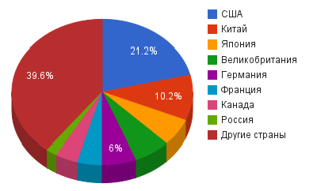

# Опытно-конструкторская работа



## Понятие

Научно-исследовательские и опытно-конструкторские работы (НИОКР)
: совокупность работ, направленных на *получение* новых знаний и
  *практическое применение* при создании нового изделия или
  технологии.

Научно-исследовательские работы (НИР)
: работы поискового, теоретического и экспериментального характера,
  выполняемые с целью определения *технической возможности* создания
  новой техники в определенные сроки.  Подразделяются на
  фундаментальные и прикладные исследования.

Опытно-конструкторские работы (ОКР) и технологические работы (ТР)
: комплекс работ по разработке конструкторской и технологической
  документации на опытный образец, по изготовлению и испытаниям
  опытного образца изделия, выполняемых по техническому заданию.

Процесс выполнения НИОКР может состоять из нескольких стадий.  Стадия
— понимается совокупность работ, характеризующаяся признаками их
*самостоятельного* планирования и финансирования, направленная на
получение предусмотренных результатов и подлежащая *обособленной
приемке*.  Каждый отдельный этап может являться *самостоятельным
результатом* интеллектуальной деятельности, факт внедрения которого не
зависит от момента окончания работ в целом.

В зависимости от жизненного цикла изделий могут быть выделены
следующие типовые этапы НИОКР:
- Исследование
  - проведение исследований, разработка технического предложения
    (аванпроекта)
  - разработка технического задания на опытно-конструкторские
    (технологические) работы
- Разработка
  - разработка эскизного проекта
  - разработка технического проекта
  - разработка рабочей конструкторской документации на изготовление
    опытного образца
  - изготовление опытного образца
  - проведение испытаний опытного образца
  - отработка документации
  - утверждение рабочей конструкторской документации для организации
    промышленного (серийного) производства изделий
- Поставка продукции на производство и эксплуатация
  - корректировка конструкторской документации по выявленным скрытым
    недостаткам
  - разработка эксплуатационной документации
- Ремонт
  - разработка рабочей конструкторской документации на проведение
    ремонтных работ
- Снятие с производства
  - разработка рабочей конструкторской документации на утилизацию

В соответствии с нормативным регулированием по способу учёта затрат
НИОКР подразделяются на:
- Товарные НИОКР (текущие, заказные) — работы, относящиеся к обычному
  виду деятельности организации, результаты которых предназначены для
  *реализации заказчику*.
- Капитальные НИОКР (инициативные, для собственных нужд) — работы,
  затраты по которым являются вложениями в *долгосрочные активы*
  организации, результаты которых используются в собственном
  производстве и/или предоставляются в пользование другим лицам.

Доля НИОКР по странам мира (Автор: Alpunin - собственная работа, CC
BY-SA 3.0,
[оригинал](https://commons.wikimedia.org/w/index.php?curid=17138633))

Роль НИОКР (R&D, research and development) растет по мере того, как
основная часть добавленной стоимости в бизнесе смещается с этапа
производства на этап разработки. На основании результатов НИОКР
принимаются ключевые решения высокотехнологичного бизнеса.  Всё
большую важность принимает НИОКР (R&D) для маркетинга: компании
отслеживают последние разработки конкурентов и потребности
потребителей с тем, чтобы согласовать с ними собственные исследования.

Вместе с тем, НИОКР — одна из самых сложных областей с точки зрения
менеджмента, отличительной особенностью большинства исследований
является трудная предсказуемость конечных результатов исследований и
их возможной коммерциализации, высокие риски. В результате, большие
затраты на НИОКР не всегда гарантируют большую прибыль или большую
долю на рынке.

## Формирование цен на НИОКР

Ценообразование на научно-исследовательские и опытно-конструкторские
работы (НИОКР) — метод установление цены на работы поискового,
теоретического и экспериментального характера, выполняемые с целью
создания новой техники.

### Фиксированные цены

Фиксированные договорные цены применяются в случаях, когда *заранее
возможно определить себестоимость* НИОКР с достаточно большой
точностью.  Фиксированные цены согласуются заказчиком и исполнителем
до начала работы по договору, и работа оплачивается независимо от
реальных издержек исполнителя (независимо от того, отличаются ли они в
большую или меньшую сторону от планировавшейся себестоимости).

В связи с этим исполнитель НИОКР полностью заинтересован в экономии
средств на выполнение данной работы, снижении материалоёмкости,
энергоёмкости, трудоёмкости работы по сравнению с указанной в
приложении к договору.  С другой стороны, в случае возникновения
незапланированных технических сложностей исполнитель вынужден,
выбиваясь за плановую смету, вкладывать собственные средства, то есть
берёт на себя всю полноту финансового риска.  Заказчик же, в свою
очередь, финансового риска не имеет, но и не имеет интереса в
сокращении издержек.

#### Твёрдая фиксируемая цена

В условиях инфляции твёрдую фиксированную цену (то есть цену, не
подлежащую изменению после подписания договора ни при каких условиях)
целесообразно устанавливать лишь на работы с небольшим сроком
исполнения; либо в договорах, предусматривающих полную предоплату.  В
противном случае, значительно вырастает финансовый риск исполнителя,
который может получить в конце работы при тех же трудозатратах
обесценившуюся сумму денег.  Как вариант, возможен изначальный расчёт
суммы договора с учётом усреднённого коэффициента инфляции и
корректировкой фиксированной цены с учётом фактора времени.

#### Фиксированная корректируемая цена

Тем не менее, в условиях инфляции чаще используют фиксированную
корректируемую модель цены.  В этом случае фиксируется не
непосредственно цена работы, но показатели, используемые при расчёте
себестоимости (материалоёмкость, энергоёмкость, трудоёмкость рабочих и
инженерно-технических работников, норматив дополнительной заработной
платы, количество и характер командировок, норматив накладных
расходов, потребное время работы машин и механизмов и т. п.), а также
норма прибыли.  Фиксированная цена корректируется лишь по причинам,
вызванным инфляцией или изменениями законодательства, связанными с
налогообложением.

### Возмещение затрат

В отличие от фиксированных цен, цены группы «возмещения затрат»
используются в тех случаях, когда затруднительно заранее предсказать
себестоимость НИОКР.  Это может быть связано с новизной, большой
сложностью разработок, необходимостью изыскания новых технических
решений.  Таковыми являются работы по созданию принципиально новых
систем, с большим объёмом конструкторских проработок и
экспериментирования, с применением новых технологий и материалов.  В
этом случае заранее можно лишь весьма приблизительно оценить
материалоёмкость, трудоёмкость работы и другие её показатели по
причине отсутствия аналогов и недостатка опыта выполнения подобных
заказов.

#### Полное возмещение издержек

Полное возмещение затрат (с учётом прибыли) подразумевает оплату
заказчиком всех затрат исполнителя по данной работе.  Такая система не
предполагает заинтересованности исполнителя в экономии средств.  В
связи с этим заказчику необходимо осуществлять постоянный контроль за
фактическим затратами, иначе реально возникновение приписок.  Это
значительно снижает привлекательность выбора этой модели
ценообразования для заказчика НИОКР.  Однако, с другой стороны, в
зависимости от результатов исследований заказчик может постоянно
корректировать техническое задание без изменения договора.

#### Лимитированное возмещение издержек

При использовании метода лимитированного возмещения издержек заказчик
до заключения договора устанавливает лимитную цену НИОКР, то есть ту
максимальную сумму, которую он готов заплатить за данную работу.  В
случае, если затраты на неё (с учётом прибыли исполнителя) не превысят
установленного лимита цены, то оплачивается лишь себестоимость НИОКР и
прибыль.  При превышении же лимитной цены разница между её размером и
фактическими затратами покрывается исполнителем.  Таким образом
заказчик снижает степень своего финансового риска и вызывает
заинтересованность исполнителя в экономии ресурсов.  Это, тем не
менее, нисколько не исключает контроль заказчика за величиной
фактических затрат, так как если они не достигают установленного
лимита цены (с учётом прибыли), то опять же не исключено возникновение
приписок.

#### Возмещение издержек по формуле долевого участия

В случае формирования цены на НИОКР по этой модели соглашением сторон
договора определяется некая ориентировочная цена НИОКР.  При этом
разница между этой ценой и фактической стоимостью работы
(себестоимость + прибыль) может быть как положительной (перерасход),
так и отрицательной (экономия).  Такая разница делится между
заказчиком и исполнителем в определённом долевом процентном
соотношении.

### Специальные цены

#### Предварительная договорённость

Несмотря на то, что формирование договорной цены по принципу
возмещения издержек не требует предварительного точного расчёта
себестоимости НИОКР, некий приблизительный расчёт для установления
лимитной или ориентировочной цены тем не менее надо проводить.  В том
случае, когда нет технической возможности сделать даже этого (НИОКР
исключительной новизны и сложности) либо существует необходимость
немедленного заключения договора и оценку стоимости работ нельзя
осуществить по причине недостатка времени, используют цены,
сформированные по принципу предварительной договорённости.

#### Участие в прибыли

В случае, когда заказчиком НИОКР является предприятие-изготовитель
разработанной исполнителем продукции, возможно участие последнего в
прибыли, получаемой заказчиком от реализации такой продукции.
Предприятие-изготовитель берёт на себя риск внедрения разработки,
выполненной исполнителем, в порядке собственной коммерческой
деятельности или специально выполняемой по договору об участии в
прибыли.  Заказчик гарантирует исполнителю согласованную долю прибыли
от выпуска серийной продукции.

При этом возможны два варианта организации расчётов.
- Изготовитель оплачивает НИОКР по себестоимости, либо по другой
  согласованной цене, а после реализации перечисляет долю своей
  прибыли от продаж.
- Исполнитель передаёт изготовителю результаты НИОКР без
  предварительной оплаты, а тот перечисляет ему долю выручки от
  продаж.

Во втором варианте расчётов финансовый риск исполнителя больше, но он
компенсируется тем, что ожидаемый конечный финансовый результат также
возрастает. 

### Ценообразование на собственные коммерческие разработки

В случае, когда научно-исследовательская или опытно-конструкторская
разработка осуществляется научно-производственным объединением за счёт
собственных средств и реализуется на свободном рынке (в том числе
международном), цена НИОКР рассчитывается коммерческим отделом
предприятия на основе маркетинговых исследований и устанавливается
исходя из характеристик спроса и предложения на аналогичную продукцию.

## Определение трудоёмкости НИОКР

Определение трудоёмкости научно-исследовательских и
опытно-конструкторских работ является сложнейшим и наиболее
конфликтогенным моментом формирования договорной цены на такую работу.
Выделяют три основных метода определения трудоёмкости НИОКР.

### Метод прямого счёта по номенклатуре работ

Для того, чтобы определить трудоёмкость НИОКР методом прямого счёта,
на этапе формирования цены на предприятии производится сбор данных от
конструкторских и производственных подразделений о трудоёмкости каждой
операции данной работы.  После обобщения и суммирования данных,
распределения работ по времени и этапам полученная трудоёмкость
используется для расчёта затрат на оплату труда.

У метода прямого счёта по номенклатуре работ есть ряд существенных недостатков:
- для сложных, комплексных работ, отличающихся новизной
  технологических решений, исследовательских, экспериментальных,
  испытательных работ зачастую не представляется возможным заранее
  определить номенклатуру и объём необходимых операций;
- метод сложен в осуществлении и дорог;
- метод приводит к завышенной оценке трудоёмкости, так как каждое
  подразделение исполнителя, в котором берутся данные, стремясь
  повысить оплату труда своих работников, а также застраховаться от
  осложнений, подаёт завышенные сведения о том, какое время необходимо
  для выполнения той или иной операции (в связи с этим, метод прямого
  счёта может быть охарактеризован как метод, выгодный исполнителю).

### Эмпирический метод

Эмпирический метод расчёта трудоёмкости НИОКР базируется на том, что
существуют определённые зависимости между техническими
характеристиками и сложностью разработки модели, устойчивые для
каждого класса техники.  Расчёт трудоёмкости НИОКР эмпирическим
методом основан на использовании специальных таблиц и графиков,
разрабатываемых научно-исследовательскими институтами соответствующей
отрасли, занимающимися вопросами экономики и организации труда.  Такие
таблицы и графики составлены на основе многолетних статистических
данных и дают возможность оценить трудоёмкость создания нового образца
техники на основе его эксплуатационных и массогабаритных
характеристик.

Недостаток эмпирического метода заключается в том, что поскольку
указанные закономерности никак теоретически не обоснованны, а являются
лишь обработкой статистических данных, неизвестно, насколько они будут
соответствовать действительности для конкретной разработки.  Поэтому
многие предприятия опасаются пользоваться такими методами, несмотря на
их простоту и сравнительную однозначность.

### Аналого-сопоставительный метод

Аналого-сопоставительный метод основан на том положении, что подобные
НИОКР имеют близкую друг другу трудоёмкость.  Поэтому для того, чтобы
оценить планируемую трудоёмкость вновь создаваемого образца техники,
исследуется фактическая трудоёмкость уже созданного аналога.  Аналогом
может являться другая модель аналогичной техники того же класса.  При
этом сходными должны быть не только технические характеристики нового
и старого образца, но и обобщённый технологический процесс создания
того и другого.  В качестве аналога ищется модель того же класса,
имеющая общее техническое (назначение, функционирование и связь
систем) и технологическое сходство.  При этом аналогичная модель может
быть разработана как тем же исполнителем НИОКР, так и другим
предприятием, если имеется доступ к соответствующей информации.

---

ПБУ 17/02 "Учет расходов на научно-исследовательские,
опытно-конструкторские и технологические работы"

НИОКР — Википедия.  <https://ru.wikipedia.org/wiki/НИОКР>

Ценнообразование на НИОКР — Википедия.
<https://ru.wikipedia.org/wiki/Ценообразование_на_НИОКР>
